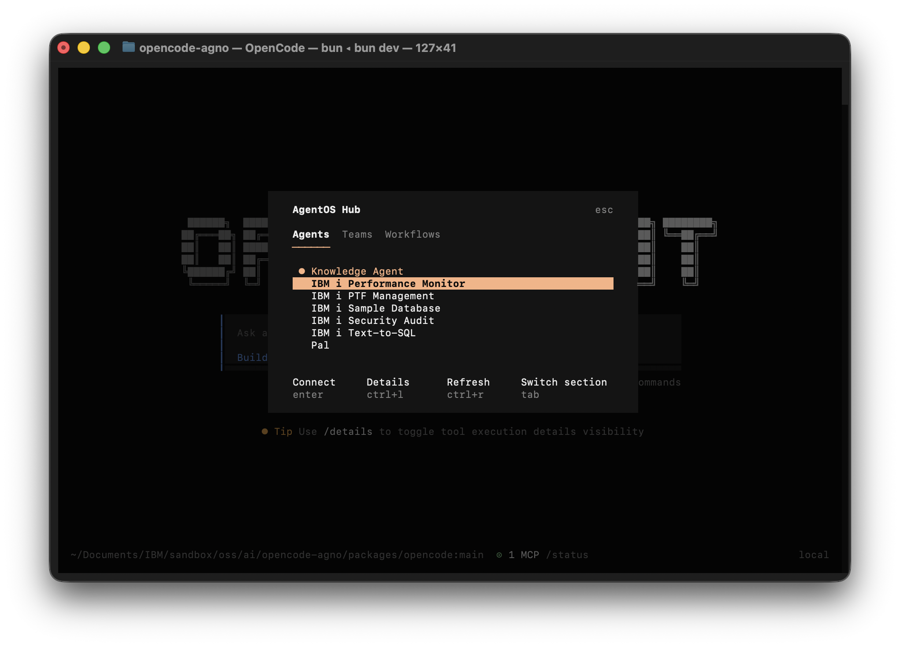

# AgentOS IBMi Docker Template

Deploy a multi-agent system to production with Docker.

[What is AgentOS?](https://docs.agno.com/agent-os/introduction) · [Agno Docs](https://docs.agno.com) · [Discord](https://agno.com/discord) · [IBM i MCP Server](https://github.com/IBM/ibmi-mcp-server)

---

## What's Included

### IBM i Agents
| Agent | Pattern | Description |
|-------|---------|-------------|
| **Text-to-SQL** | MCP | Translates natural language into SQL for Db2 for i |
| **Performance Monitor** | MCP + Reasoning | System performance analysis - CPU, memory, I/O metrics |
| **Security Audit** | MCP | Vulnerability assessment and remediation for IBM i security |
| **Library List Security** | MCP + Reasoning | Library list analysis and CWE-427 attack prevention |
| **PTF Management** | MCP | PTF group currency monitoring and maintenance planning |
| **Sample Database** | MCP | Demo agent for exploring the SAMPLE schema |

### Knowledge Agents
| Agent | Pattern | Description |
|-------|---------|-------------|
| **Pal** | Learning + Tools | Your AI-powered second brain |
| Knowledge Agent | RAG | Answers questions from a knowledge base of IBM docs |


**Pal** (Personal Agent that Learns) is your AI-powered second brain. It researches, captures, organizes, connects, and retrieves your personal knowledge - so nothing useful is ever lost.

---

## Quick Start

### Prerequisites

- [Docker Desktop](https://www.docker.com/products/docker-desktop)
- [Anthropic API key](https://console.anthropic.com/settings/keys)
- An IBM i user profile with [Mapepire](https://ibm-d95bab6e.mintlify.app/quickstart) database server installed on the system


### 1. Clone and configure
```sh
git clone https://github.com/agno-agi/agentos-docker-template.git agentos-docker
cd agentos-docker
cp example.env .env
```

### 2. Configure `.env`

Add your API keys and IBM i connection details:
```sh
# Required - at least one model provider API key
ANTHROPIC_API_KEY=sk-ant-***

# IBM i connection
DB2i_HOST=your-ibmi-hostname
DB2i_USER=your-ibmi-user
DB2i_PASS=your-ibmi-password

# Model configuration (optional - defaults to Anthropic Claude)
# Format: "<provider>:<model_id>" - see https://docs.agno.com/models/providers/model-index
AGENT_MODEL=anthropic:claude-sonnet-4-5
AGENT_TEAM_MEMBER_MODEL=anthropic:claude-haiku-4-5

# Optional
EXA_API_KEY=***          # Exa API key for web research (used by Pal)
```

### 3. Start locally
```sh
docker compose up -d --build
```

- **API**: http://localhost:8000
- **Docs**: http://localhost:8000/docs
- **Database**: localhost:5432

### 4. Connect to control plane

1. Open [os.agno.com](https://os.agno.com)
2. Click "Add OS" → "Local"
3. Enter `http://localhost:8000`

### 5. ⚠️ Connect to OpenAgent (experimental)

1. Clone [OpenAgent](https://github.com/ajshedivy/openagent)
2. Follow [Quickstart](https://github.com/ajshedivy/openagent?tab=readme-ov-file#quick-start) to run locally
3. Add the AgentOS endpoint to `opencode.json`:
```json
{
  "$schema": "https://opencode.ai/config.json",
  "provider": {
    "agentos": {
      "name": "AgentOS",
      "options": {
        "baseURL": "http://localhost:8000"
      }
    }
  }
}
```




---

## The Agents

### Text-to-SQL

Translates natural language questions into SQL queries for Db2 for i. Handles schema discovery, query validation, and execution.

**What it does:**

| Capability | Description |
|------------|-------------|
| **Schema Discovery** | Explore tables, views, and column metadata |
| **Query Validation** | Validates SQL syntax using IBM i's native parser before execution |
| **Data Sampling** | Preview table data to understand structure |
| **Table Statistics** | Row counts, size, and usage metrics |

**Try it:**
```
What tables are in the SAMPLE schema?
Show me all employees with a salary over 50000
How many rows are in SAMPLE.EMPLOYEE?
```

**How it works:**
- **MCP tools** connect to Db2 for i via the IBM i MCP server
- **Validate-first workflow** ensures queries are syntactically correct before running
- Uses IBM i SQL conventions (fully qualified names, `FETCH FIRST N ROWS ONLY`)

### Performance Monitor

Monitors IBM i system performance — CPU, memory, I/O metrics — and provides actionable optimization insights.

**What it monitors:**

| Metric | Description |
|--------|-------------|
| **System Status** | CPU utilization, active jobs, system ASP |
| **Memory Pools** | Pool sizes, faults, activity levels |
| **HTTP Servers** | Connections, threads, request handling |
| **Active Jobs** | CPU consumption patterns and job activity |

**Try it:**
```
What is the current system status?
Check memory pool utilization
Are there any performance bottlenecks?
Show me the top CPU consuming jobs
```

**How it works:**
- **MCP tools** query QSYS2 system health views and Collection Services
- **Reasoning tools** analyze patterns and correlations across metrics
- Provides prioritized recommendations with remediation steps

### Security Audit

Comprehensive security vulnerability assessment and guided remediation for IBM i systems.

**What it assesses:**

| Area | Description |
|------|-------------|
| **User Privileges** | Limited capability users, special authorities (*ALLOBJ, *SAVSYS) |
| **File Permissions** | Files readable, writable, deletable, or updatable by *PUBLIC |
| **Attack Vectors** | Trigger attacks, rename attacks, library list poisoning |
| **Impersonation** | User profiles vulnerable to impersonation |
| **Command Security** | Public authority on dangerous commands, audit settings |

**Try it:**
```
Perform a security audit of user privileges
Which files are readable by any user?
Are there any user profiles vulnerable to impersonation?
Check command audit settings for ADDPFTRG
```

**How it works:**
- **MCP tools** query QSYS2 security views and authority tables
- **Assessment-first workflow** — always analyzes before recommending changes
- Remediation tools (lockdown commands) require explicit user confirmation

### Library List Security

Analyzes library list configurations to protect against "Uncontrolled Search Path Element" attacks (CWE-427).

**What it checks:**

| Check | Description |
|-------|-------------|
| **QSYSLIBL / QUSRLIBL** | System and user library list configuration |
| **CHGSYSLIBL Security** | Whether *PUBLIC can modify the system library list |
| **Library Authority** | Libraries with excessive *PUBLIC permissions |
| **Attack Surface** | Libraries where attackers could insert malicious objects |

**Try it:**
```
Analyze the security of my library list configuration
Can *PUBLIC execute CHGSYSLIBL?
Which libraries have excessive authority?
Show me the complete library list hierarchy
```

**How it works:**
- **MCP tools** inspect system values and library authorities
- **Reasoning tools** evaluate risk levels and prioritize findings
- Explains the attack scenario for each vulnerability found

### PTF Management

Monitors PTF (Program Temporary Fix) group currency and helps plan maintenance windows.

**What it tracks:**

| Capability | Description |
|------------|-------------|
| **PTF Currency** | Group status, levels behind, update availability |
| **Critical Updates** | Groups significantly behind with priority ranking |
| **Group Details** | Installed vs. available levels for each PTF group |
| **Maintenance Planning** | Update schedules based on criticality |

**Try it:**
```
What is the PTF status of this system?
Are there any critical PTF updates needed?
Show me details for the HIPER PTF group
Which PTF groups are most out of date?
```

**How it works:**
- **MCP tools** query PTF group info and currency data from QSYS2
- Prioritizes by levels behind and group type (HIPER, Security, Database)
- Distinguishes critical security updates from routine maintenance

### Sample Database

Demo agent for exploring IBM's SAMPLE schema — employees, departments, projects, and salary data.

**What it queries:**

| Data | Description |
|------|-------------|
| **Employees** | Lookup, search, and filter by department or job |
| **Departments** | Organizational structure and reporting relationships |
| **Projects** | Team assignments and project status |
| **Salary Analysis** | Department stats, bonus calculations, range filters |

**Try it:**
```
Show me the employees in the SAMPLE database
Who works in department A00?
What are the salary statistics by department?
Which projects is employee 000010 assigned to?
```

**How it works:**
- **MCP tools** query the standard IBM i SAMPLE schema
- Educational focus — explains SQL concepts and IBM i conventions as it works
- Demonstrates query patterns adaptable to your own data

### Pal (Personal Agent that Learns)

Your AI-powered second brain. Pal researches, captures, organizes, connects, and retrieves your personal knowledge - so nothing useful is ever lost.

**What Pal stores:**

| Type | Examples |
|------|----------|
| **Notes** | Ideas, decisions, snippets, learnings |
| **Bookmarks** | URLs with context - why you saved it |
| **People** | Contacts - who they are, how you know them |
| **Meetings** | Notes, decisions, action items |
| **Projects** | Goals, status, related items |
| **Research** | Findings from web search, saved for later |

**Try it:**
```
Note: decided to use Postgres for the new project - better JSON support
Bookmark https://www.ashpreetbedi.com/articles/lm-technical-design - great intro
Research event sourcing patterns and save the key findings
What notes do I have?
What do I know about event sourcing?
```

**How it works:**
- **DuckDB** stores your actual data (notes, bookmarks, people, etc.)
- **Learning system** remembers schemas and research findings
- **Exa search** powers web research, company lookup, and people search

**Data persistence:** Pal stores structured data in DuckDB at `/data/pal.db`. This persists across container restarts.

> **Requires:** `OPENAI_API_KEY` for embeddings. `EXA_API_KEY` is optional — enables web research, company lookup, and people search.

### Knowledge Agent

Answers questions using a vector knowledge base (RAG pattern).

**Try it:**
```
What is the IBM i MCP server?
How do I create an agent with the IBM i MCP server?
What documents are in your knowledge base?
```

**Load documents:**
```sh
docker exec -it agentos-api python -m agents.knowledge_agent
```

> **Requires:** `OPENAI_API_KEY` for embeddings.

---

## Project Structure
```
├── agents/
│   ├── utils/
│   │   ├── common.py                    # Shared model config and instructions
│   │   └── tools.py                     # Toolset loader for MCP tool filtering
│   ├── pal.py                           # Personal second brain agent
│   ├── knowledge_agent.py               # RAG agent
│   ├── text2sql_agent.py                # Natural language to SQL
│   ├── performance_agent.py             # System performance monitoring
│   ├── security_audit_agent.py          # Security vulnerability assessment
│   ├── library_list_security_agent.py   # Library list attack prevention
│   ├── ptf_agent.py                     # PTF group management
│   └── sample_data_agent.py             # SAMPLE schema demo
├── tools/                               # IBM i MCP tools
├── app/
│   ├── main.py                          # AgentOS entry point
│   └── config.yaml                      # Quick prompts config
├── db/
│   ├── session.py                       # Database session
│   └── url.py                           # Connection URL builder
├── scripts/                             # Helper scripts
├── compose.yaml                         # Docker Compose config
└── pyproject.toml                       # Dependencies
```

---

## Common Tasks

### Add your own agent

1. Create `agents/my_agent.py`:
```python
from agno.agent import Agent
from agents.utils.common import AGENT_MODEL
from db.session import get_postgres_db

my_agent = Agent(
    id="my-agent",
    name="My Agent",
    model=AGENT_MODEL,
    db=get_postgres_db(),
    instructions="You are a helpful assistant.",
)
```

2. Register in `app/main.py`:
```python
from agents.my_agent import my_agent

agent_os = AgentOS(
    name="AgentOS",
    agents=[pal, knowledge_agent, mcp_agent, my_agent],
    ...
)
```

3. Restart: `docker compose restart`

### Add tools to an agent

Agno includes 100+ tool integrations. See the [full list](https://docs.agno.com/tools/toolkits).
```python
from agno.tools.slack import SlackTools
from agno.tools.google_calendar import GoogleCalendarTools

my_agent = Agent(
    ...
    tools=[
        SlackTools(),
        GoogleCalendarTools(),
    ],
)
```

### Add dependencies

1. Edit `pyproject.toml`
2. Regenerate requirements: `./scripts/generate_requirements.sh`
3. Rebuild: `docker compose up -d --build`

### Use a different model provider

All agents use a shared model configuration via environment variables. To switch providers:

1. Add your API key to `.env` (e.g., `OPENAI_API_KEY`)
2. Set the model env vars in `.env`:
```sh
# OpenAI
AGENT_MODEL=openai:gpt-4o
AGENT_TEAM_MEMBER_MODEL=openai:gpt-4o-mini

# Google Gemini
AGENT_MODEL=google:gemini-2.0-flash

# AWS Bedrock
AGENT_MODEL=aws-bedrock:anthropic.claude-sonnet-4-5-v1

# Any provider supported by agno
# See full list: https://docs.agno.com/models/providers/model-index
```
3. Add the provider's SDK dependency to `pyproject.toml` if not already present
4. Restart: `docker compose restart`

---

## Local Development

For development without Docker:
```sh
# Install uv
curl -LsSf https://astral.sh/uv/install.sh | sh

# Setup environment
./scripts/venv_setup.sh
source .venv/bin/activate

# Start PostgreSQL (required)
docker compose up -d agentos-db

# Run the app
python -m app.main
```

### Regenerate toolsets.json

After adding or editing tool YAML files in `tools/`, regenerate the consolidated toolset mapping:

```sh
python parse_mcp_tools.py
```

This parses all YAML files in `tools/`, validates them against the MCP server schema, and writes `tools/toolsets.json`. Agents load toolsets from this file at startup via `get_toolset()`.

Options:
```sh
python parse_mcp_tools.py --tools-dir tools --output tools/toolsets.json  # explicit paths
python parse_mcp_tools.py --skip-validation                               # skip schema validation
```

---

## Environment Variables

| Variable | Required | Default | Description |
|----------|----------|---------|-------------|
| `ANTHROPIC_API_KEY` | Yes* | - | Anthropic API key (*or another provider's key) |
| `DB2i_HOST` | Yes | - | IBM i hostname or IP address |
| `DB2i_USER` | Yes | - | IBM i user profile |
| `DB2i_PASS` | Yes | - | IBM i password |
| `AGENT_MODEL` | No | `anthropic:claude-sonnet-4-5` | Model for agents ([provider index](https://docs.agno.com/models/providers/model-index)) |
| `AGENT_TEAM_MEMBER_MODEL` | No | `anthropic:claude-haiku-4-5` | Lightweight model for team members |
| `EXA_API_KEY` | No | - | Exa API key for web research |
| `DB_HOST` | No | `localhost` | PostgreSQL host |
| `DB_PORT` | No | `5432` | PostgreSQL port |
| `DB_USER` | No | `ai` | PostgreSQL user |
| `DB_PASS` | No | `ai` | PostgreSQL password |
| `DB_DATABASE` | No | `ai` | PostgreSQL database name |
| `DATA_DIR` | No | `/data` | Directory for DuckDB storage |
| `RUNTIME_ENV` | No | `prd` | Set to `dev` for auto-reload |

---

## Extending Pal

Pal is designed to be extended. Connect it to your existing tools:

### Communication
```python
from agno.tools.slack import SlackTools
from agno.tools.gmail import GmailTools

tools=[
    ...
    SlackTools(),    # Capture decisions from Slack
    GmailTools(),    # Track important emails
]
```

### Productivity
```python
from agno.tools.google_calendar import GoogleCalendarTools
from agno.tools.linear import LinearTools

tools=[
    ...
    GoogleCalendarTools(),  # Meeting context
    LinearTools(),          # Project tracking
]
```

### Research
```python
from agno.tools.yfinance import YFinanceTools
from agno.tools.github import GithubTools

tools=[
    ...
    YFinanceTools(),  # Financial data
    GithubTools(),    # Code and repos
]
```

See the [Agno Tools documentation](https://docs.agno.com/tools/toolkits) for the full list of available integrations.

---

## Learn More

- [IBM i MCP Server](https://github.com/IBM/ibmi-mcp-server)
- [Agno Documentation](https://docs.agno.com)
- [AgentOS Documentation](https://docs.agno.com/agent-os/introduction)
- [Tools & Integrations](https://docs.agno.com/tools/toolkits)
- [Discord Community](https://agno.com/discord)
